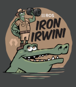

<h3 align="center">A passionate frontend developer from Nigeria</h3>

  

  

- 🔭 I’m currently working on [PageTriage](https://www.mediawiki.org/wiki/Extension:PageTriage)

- 🌱 I’m currently learning **CodeX, ORES, PageTriage,Wikimedia API, Mautic, Typescript**

- 👯 I’m looking to collaborate on [PageTriage](https://www.mediawiki.org/wiki/Extension:PageTriage)

- 🤝 I’m looking for help with [PageTriage](https://www.mediawiki.org/wiki/Extension:PageTriage)

- 💬 Ask me about **Javascript/Vuejs, PHP/Laravel, Python/Django, C/C++ and Docker/Docker Compose**

- 📫 How to reach me **developer.oduwa@gmail.com, obamwonyioduwa@gmail.com, destiny.obamwonyi@eng.uniben.edu**

<h3 align="left">Connect with me:</h3>

<h3 align="left">Languages:</h3>

 
   
   
   
 
   
   
   

<h3 align="left">Frameworks:</h3>

 
   
   
    

<h3 align="left">Database Management Systems(DBMS)</h3>
   
   

<!------------------------------------------------------------------>
<h3 align="left">HardWare/Robotics</h3>
   
     

<!------------------------------------------------------------------>
<h3 align="left">Hosting</h3>
   
   

<!-------------------------------------------------------------->
<h3 align="left">Operating Systems</h3>
   
     

<h3 align="left">Other Tools:</h3>

 

   
   
   
   

   

  

&nbsp;

